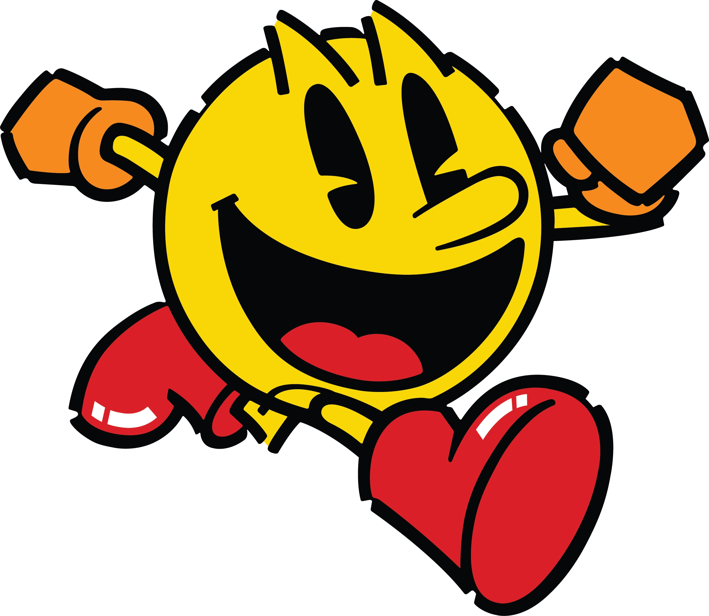

# PAC-MAN

<!-- PROJECT LOGO -->
<br />
<p align="center">
  <a href="https://github.com/RomainDur/PacMan">
    
  </a>

<h3 align="center"><a href="https://github.com/RomainDur/PacMan"></a></h3>

  <p align="center">
    Jeu reproduisant le bien connu Pac-Man
    <br />
    <br />
    <a href="https://fr.wikipedia.org/wiki/Pac-Man">Lire le wiki</a>
    ·
    <a href="https://github.com/RomainDur/projects">Voir le Projet</a>
    <br />
  </p>

<!-- TABLE OF CONTENTS -->
<details open="open">
  <summary>Table des Matières</summary>
  <ol>
    <li>
      <a href="#à-propos-du-projet">À Propos du Projet</a>
      <ul>
        <li><a href="#Avancé du projet">Avancé du projet</a></li>
        <li><a href="#créé-avec">Créé avec</a></li>
      </ul>
    </li>
    <li>
      <a href="#commencer">Commencer</a>
      <ul>
        <li><a href="#prérequis">Prérequis</a></li>
        <li><a href="#installation">Installation</a></li>
      </ul>
    </li>
    <li><a href="#utilisation">Utilisation</a></li>
      <ul>
        <li><a href="#exécution">Exécution</a></li>     
      </ul>
    <li><a href="#arborescence">Arborescence</a></li>
    <li><a href="#crédits">Crédits</a></li>
    <li><a href="#contact">Contact</a></li>
  </ol>
</details>

***

<!-- ABOUT THE PROJECT -->
## À Propos du Projet
Jeu réalisé d'octobre à décembre 2022 avec Nino Dauviers, Thomas Allouche, Tom Cousteils et Dylan Maligue pour le projet final de   
Génie Logiciel en Master 1 Info.   
Ajout en février 2023 sur GitHub avec un README.

## Avancé du projet

Le projet est terminé.

Améliorations possibles :  
-Ajout de plusieurs niveaux de difficulté.  
-Ajout d'un compteur de point et mémorisation du score. Affichage dans le menu Scores.  
-Redimensionner les menus Scores, Option, Credits.  
-Correction du problème lié au son.  
-Ajouter un bouton Retry après un échec ou une victoire.  
-Améliorer la fluidité des déplacements.  

### Créé avec
* [Java OpenJDK](https://openjdk.java.net/)

<!-- GETTING STARTED -->
## Commencer

### Prérequis

* Installer la version 17 32 bits d'OpenJDK.


### Installation

1. Cloner le dépôt sur votre machine
   ```sh
   git clone https://github.com/RomainDur/PacMan.git
   ```
2. Pac-Man est maintenant prêt à être utilisé.

<!-- USAGE EXAMPLES -->
## Utilisation

### Exécution
Executer l'application Launcher (classe Main du projet).

### Génération

Pour générer la Javadoc:

Onglet "Tools" puis "Generate JavaDoc".

<!-- TREE STRUCTURE -->
## Arborescence
<details>

_TODO_

</details>

<!-- CREDITS -->
## Crédits

Romain Durand [ [GitHub](https://github.com/RomainDur) ] – Co-développeur
<br>
Nino Dauviers – Co-développeur
<br>
Thomas Allouche – Co-développeur
<br>
Tom Cousteils – Co-développeur
<br>
Dylan Maligue – Co-développeur

<!-- CONTACT -->
## Contact

Lien du Projet : https://github.com/RomainDur/PacMan
